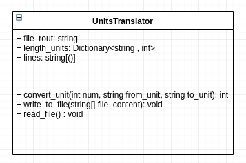
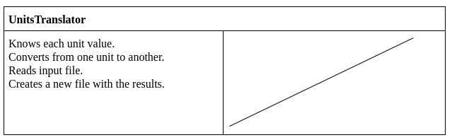

# Universal_Translator
Universal translator is a console application that allows you to convert any length unit under the metric system to another in the same system. Universal translator will requiere you to feed it a file with the units you want to convert.

Universal translator uses the same base unit as the metric system, which is the meter.

## File_Format
If you want to know how the file should be structured you should go to the file examples folder.  
There you will find an example of the the file you should give the program (test.txt) and the result file after the convertion (result.txt)

v = value   
fu = from unit  
tu = to unit  
km = kilimeters.  
m = meters.  
cm = centimeter.  
mm = millimeter.  
um = micrometer.  
nm = nanometer.  

## How to use it  
Before we start make sure you have everything setup as per the requirements section. 

Follow those steps:  

1. Type python3 universal_translator.py into your console (you have to be on the same directory as the universal_translator.py file).   

2. The program will ask you for your file route. If you already are on the same folder as your file you just have to type your file name + it's extension (.txt). If you are not on the same directory as your file you will have to type the full path. Example: /home/username/Documents/test.txt.  

3. You will then be asked to introduce the name of the result file(this file will contain the results of the convertion), You should not put the extension, the program will set it to .txt by default.  

4. A result file will be generated with the solution. This file will be on the same directory you ran universal_translator.py.  

## Class diagram of the program (UML)    
  

## CRC card of the program    
  

## Requirements  
You need:  
python >= 3.6+   
pipenv  
